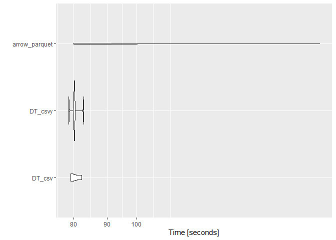

Read
================
Brendan Knapp
10/8/2019

``` r
dl_path <- "datasets/yellow_tripdata_2010-01.csv"

if (!file.exists(dl_path)) {
  download.file(
    "https://s3.amazonaws.com/nyc-tlc/trip+data/yellow_tripdata_2010-01.csv",
    destfile = dl_path
  )
}
```

``` r
library(data.table)
library(arrow)
library(scales)
library(microbenchmark)
library(ggplot2)
```

``` r
col_names <- c("vendor_id", "pickup_datetime", "dropoff_datetime", 
               "passenger_count", "trip_distance", "pickup_longitude", 
               "pickup_latitude", "rate_code", "store_and_fwd_flag", 
               "dropoff_longitude", "dropoff_latitude", "payment_type", 
               "fare_amount", "surcharge", "mta_tax", "tip_amount", 
               "tolls_amount", "total_amount")

init <- fread(dl_path)
colnames(init) <- col_names

big_df <- rbindlist(
  replicate(n = 5, init, simplify = FALSE)
)

setNames(comma(dim(big_df)), c("# rows", "# cols"))
```

    ##       # rows       # cols 
    ## "74,318,890"         "18"

``` r
csv_path <- "datasets/csvy-file.csv"
csvy_path <- "datasets/csvy-file.csvy"
parquet_path <- "datasets/parquet-file.parquet"


fwrite(big_df, file = csv_path)
fwrite(big_df, file = csvy_path)
write_parquet(big_df, sink = parquet_path)

number_bytes(
  file.size(c(csv_path, csvy_path, parquet_path))
)
```

    ## [1] "8 Gb" "8 Gb" "6 Gb"

``` r
res <- microbenchmark::microbenchmark(
  DT_csv = fread(csv_path, showProgress = FALSE),

  DT_csvy = fread(csvy_path, showProgress = FALSE),
  
  arrow_parquet = read_parquet(parquet_path),
  

  times = 5
)
```

``` r
res
```

    ## Unit: seconds
    ##           expr      min       lq      mean   median        uq       max
    ##         DT_csv 79.13196 79.41450  80.33133 79.48502  81.33019  82.29499
    ##        DT_csvy 78.60473 80.06919  80.38983 80.19296  80.24047  82.84178
    ##  arrow_parquet 79.95758 84.43273 110.11436 85.31017 110.12591 190.74540
    ##  neval
    ##      5
    ##      5
    ##      5

``` r
ggplot2::autoplot(res)
```

<!-- -->

``` r
data.table::getDTthreads()
```

    ## [1] 8

``` r
sessionInfo()
```

    ## R version 3.6.1 (2019-07-05)
    ## Platform: x86_64-w64-mingw32/x64 (64-bit)
    ## Running under: Windows 10 x64 (build 18362)
    ## 
    ## Matrix products: default
    ## 
    ## locale:
    ## [1] LC_COLLATE=English_United States.1252 
    ## [2] LC_CTYPE=English_United States.1252   
    ## [3] LC_MONETARY=English_United States.1252
    ## [4] LC_NUMERIC=C                          
    ## [5] LC_TIME=English_United States.1252    
    ## 
    ## attached base packages:
    ## [1] stats     graphics  grDevices utils     datasets  methods   base     
    ## 
    ## other attached packages:
    ## [1] ggplot2_3.2.1        microbenchmark_1.4-6 scales_1.0.0        
    ## [4] arrow_0.15.0         data.table_1.12.4   
    ## 
    ## loaded via a namespace (and not attached):
    ##  [1] Rcpp_1.0.2        knitr_1.25        magrittr_1.5     
    ##  [4] tidyselect_0.2.5  bit_1.1-14        munsell_0.5.0    
    ##  [7] colorspace_1.4-1  R6_2.4.0          rlang_0.4.0      
    ## [10] dplyr_0.8.3       stringr_1.4.0     tools_3.6.1      
    ## [13] grid_3.6.1        gtable_0.3.0      xfun_0.10        
    ## [16] withr_2.1.2       htmltools_0.3.6   lazyeval_0.2.2   
    ## [19] yaml_2.2.0        bit64_0.9-7       assertthat_0.2.1 
    ## [22] digest_0.6.21     tibble_2.1.3      crayon_1.3.4     
    ## [25] purrr_0.3.2       glue_1.3.1.9000   evaluate_0.14    
    ## [28] rmarkdown_1.16    stringi_1.4.3     pillar_1.4.2.9001
    ## [31] compiler_3.6.1    pkgconfig_2.0.3
